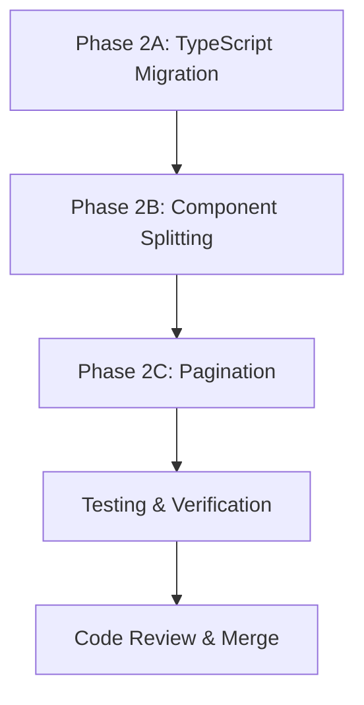

# Phase 2 Implementation Plan

**Date Created:** 2025-11-11
**Status:** Planning
**Estimated Total Time:** 12-15 hours (across high-priority tasks)
**Primary Focus:** TypeScript Migration, Component Splitting, Pagination

---

## Objective

Transform the NDT Suite personnel management system from a monolithic JavaScript codebase into a modular, type-safe, performant TypeScript application with proper component architecture and data pagination.

---

## Strategic Approach

### Phase 2A: TypeScript Migration (3-4 hours)
**Goal:** Full type safety for services and main personnel page

**Rationale:**
- Type safety prevents runtime errors
- Better IDE autocomplete and IntelliSense
- Easier refactoring during component splitting
- Types already defined in `src/types/` - ready to use

**Order of Migration:**
1. **Services first** (easier, fewer dependencies)
   - `personnel-service.js` → `personnel-service.ts`
   - `competency-service.js` → `competency-service.ts`
2. **Page component last** (more complex, depends on services)
   - `PersonnelManagementPage.jsx` → `PersonnelManagementPage.tsx`

**Success Criteria:**
- Zero TypeScript errors (`npx tsc --noEmit`)
- All functions have type signatures
- No `any` types (except where truly necessary)
- All Supabase queries properly typed

---

### Phase 2B: Component Splitting (4-5 hours)
**Goal:** Break PersonnelManagementPage (2,567 lines) into manageable components

**Rationale:**
- Current file is too large to maintain
- Difficult to debug and test
- Violates single responsibility principle
- Blocks team collaboration (merge conflicts)

**Component Extraction Strategy:**

1. **Extract Custom Hooks First** (decouples logic from UI)
   - `usePersonnelData.ts` - Data fetching and state
   - `usePersonnelFilters.ts` - Filter logic
   - `usePersonnelSort.ts` - Sorting logic

2. **Extract View Components** (major UI sections)
   - `DirectoryView.tsx` - Personnel directory list
   - `MatrixView.tsx` - Competency matrix grid
   - `ExpiringView.tsx` - Expiring certifications
   - `PendingApprovalsView.tsx` - Approval workflow

3. **Extract Utility Components** (reusable UI elements)
   - `PersonnelFilters.tsx` - Filter controls
   - `PersonnelStats.tsx` - Statistics cards

**Target Architecture:**
```
PersonnelManagementPage.tsx (<500 lines)
├── usePersonnelData()
├── usePersonnelFilters()
├── usePersonnelSort()
├── <PersonnelStats />
├── <PersonnelFilters />
└── View switcher
    ├── <DirectoryView />
    ├── <MatrixView />
    ├── <ExpiringView />
    └── <PendingApprovalsView />
```

**Success Criteria:**
- PersonnelManagementPage < 500 lines
- Each component < 300 lines
- All functionality preserved
- No regressions in behavior

---

### Phase 2C: Pagination (2-3 hours)
**Goal:** Handle 100+ personnel records without performance issues

**Rationale:**
- Current: Loads ALL personnel at once
- Problem: Performance degrades with 100+ users
- Solution: Client-side pagination (data already loaded efficiently)

**Implementation:**
- Page size: 25 items per page
- Clean pagination controls
- Preserve page state during view switches
- Reset to page 1 when filters change

**Success Criteria:**
- Only 25 items rendered per page
- Smooth page transitions
- Performance acceptable with 500+ records
- Pagination state managed properly

---

## Implementation Order & Dependencies



**Why This Order:**
1. **TypeScript first** - Makes refactoring safer with type checking
2. **Component splitting second** - Easier to paginate smaller components
3. **Pagination last** - Can be implemented in isolated components

---

## Medium Priority Tasks (Optional)

### Redux Toolkit Query (3-4 hours)
- Better caching and data synchronization
- Reduces boilerplate
- Automatic refetching
- **Decision:** Defer to Phase 3 (nice-to-have, not critical)

### Design System Adoption (4-5 hours)
- Replace inline styles with CSS classes
- Use design tokens consistently
- **Decision:** Can be done incrementally alongside other work

### Audit Logging (2-3 hours)
- Database triggers for competency changes
- **Decision:** Defer to Phase 3 (backend-heavy work)

---

## Risk Assessment & Mitigation

### Risk 1: Breaking Existing Functionality
**Probability:** Medium
**Impact:** High
**Mitigation:**
- Work incrementally (commit after each component)
- Test each component thoroughly before moving to next
- Keep original file as reference
- Use git branches for safe experimentation

### Risk 2: TypeScript Type Complexity
**Probability:** Low
**Impact:** Medium
**Mitigation:**
- Types already defined in `src/types/personnel.ts`
- Reference Phase 1 work for patterns
- Use `unknown` instead of `any` when truly needed
- Incremental typing (one file at a time)

### Risk 3: Component Dependencies Breaking
**Probability:** Medium
**Impact:** Medium
**Mitigation:**
- Document all props interfaces
- Use TypeScript to enforce correct prop passing
- Test parent-child communication thoroughly
- Maintain `onRefresh` callback pattern from Phase 1

### Risk 4: Pagination State Management
**Probability:** Low
**Impact:** Low
**Mitigation:**
- Use simple useState for page number
- Reset logic in useEffect with proper dependencies
- Test filter + pagination interaction

---

## Testing Strategy

### During Implementation:
1. **Manual testing** after each component extraction
2. **Browser DevTools** to verify:
   - No console errors
   - Network requests optimized (still 2 queries)
   - Memory usage stable
3. **TypeScript compiler** - zero errors at all times
4. **Functional testing** - all features work identically

### Before Merge:
1. Run `/build-and-fix` - ensure build succeeds
2. Run `/code-review` - security and quality check
3. Test all user workflows:
   - View personnel directory
   - Search and filter
   - Add/edit/delete competencies
   - Approve/reject competencies
   - Export data
   - Navigate between views
4. Test with different user roles (admin, org_admin, editor, viewer)

---

## Rollback Plan

If critical issues arise:

1. **Git revert** to last working commit
2. **Feature flag** - add toggle to use old vs new code
3. **Incremental rollout** - release to subset of users first

---

## Success Metrics

**Code Quality:**
- [ ] PersonnelManagementPage < 500 lines (from 2,567)
- [ ] Zero TypeScript errors
- [ ] All components < 300 lines
- [ ] No `any` types used

**Performance:**
- [ ] Page load time < 1 second (maintained from Phase 1)
- [ ] Pagination reduces DOM nodes by 75%+
- [ ] Memory usage stable during navigation

**Maintainability:**
- [ ] Each component has single responsibility
- [ ] Props clearly defined with interfaces
- [ ] Code easier to understand and modify
- [ ] Components reusable and testable

**Functionality:**
- [ ] All features work identically to before
- [ ] No regressions in user workflows
- [ ] Toast notifications working
- [ ] Confirmation dialogs working

---

## Timeline Estimate

**Optimistic:** 10 hours
**Realistic:** 12-15 hours
**Pessimistic:** 18 hours (if major issues encountered)

**Breakdown:**
- TypeScript Migration: 3-4 hours
- Component Splitting: 4-5 hours
- Pagination: 2-3 hours
- Testing & Bug Fixes: 2-3 hours
- Code Review & Documentation: 1 hour

---

## Next Steps

1. **Get user approval** for this plan
2. **Create feature branch**: `phase2/typescript-refactor`
3. **Start with TypeScript migration** (smallest, safest first step)
4. **Commit frequently** with descriptive messages
5. **Update phase2-tasks.md** as work progresses

---

**Plan prepared by:** Claude Code
**Reviewed by:** [Pending user approval]
**Version:** 1.0.0
